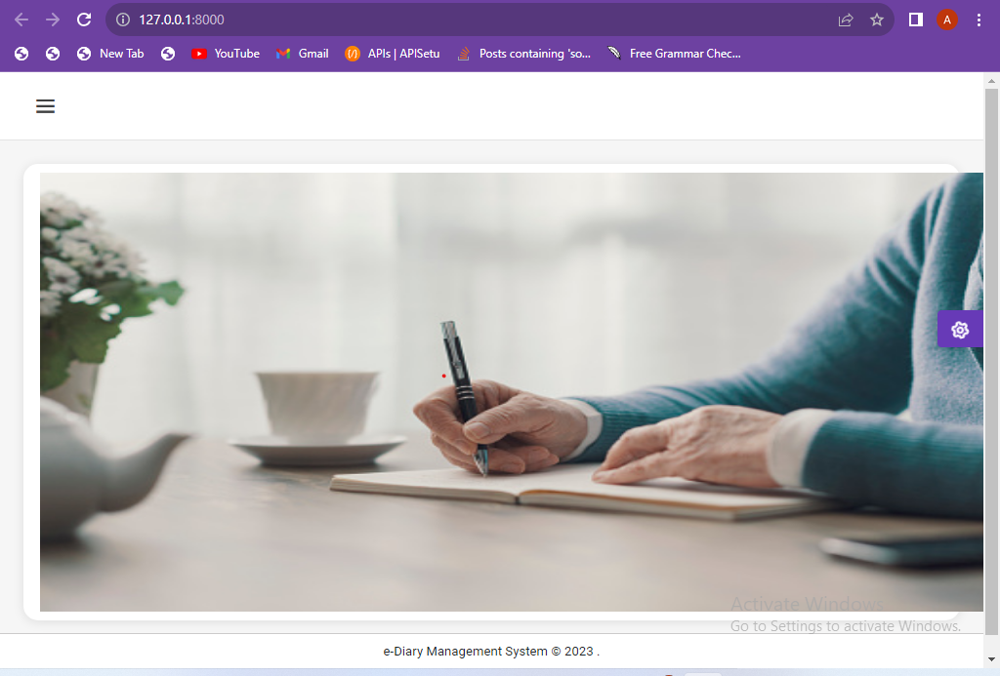

# eDiary Management System

### *<strong>eDiary Management System (Both frontend and backend) created with Python and Django .</strong>*
 

## Features

 * Through registration, users gain the ability to upload notes categorized according to their preferences. 
   * Empowering the user with capability to create custom categories, thus facilitating seamless organization and personalized note-taking.
   * The user has the flexibility to create diary organized into various category,enhancing their ability to manage information effectively.
   * User's diary are strictly accessible only to them,ensuring utmost privacy and security.

## <em>Home page</em> :
  

 

## <em>Login & Registration page</em>  :
  

## <em>Dashboard & All Functional Views</em> :
  

 

 

## <em>Update Profile View</em> :
  

 

